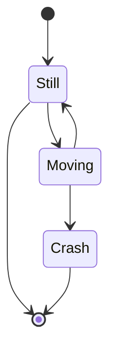

---

layout: post

title: "Notes Git - Spanish"

modified:

categories:

excerpt: >

 Mis notas sobre el curso y mi experiencia con Git y gitHub

tags: []

image:

feature:

date: 2021-04-29T08:23:53-07:00

---


# Notes Linux Command (Spanish)


## Directorio base de Linux

**Primer paso: Generar tus llaves SSH**. Recuerda que es muy buena idea proteger tu llave privada con una contraseña.

~~~gfm

~~~


## Comands

Listar archivos:

```bash
ls
ls -lS
ls -lr
ls namedirectory
```

Listar archivos para ver su peso de una manera mas mas legible

```bash
ls -lh
```

Listar archivos ocultos:

```bash
ls -a
```

Identificar la ruta en la que estamos en nuestro sistema: **P**rint **W**orking **D**irectory

```bash
pwd
```

Movernos entre directorios:

```bash
cd
```

Crear un directorio:

```
mkdir namedirectory
```

Copiar un archivo:

```bash
cp
```

Borrar un archivo:

```bash
rm
rm -i myfile // interactive directory
rm -ir directory // delete all child directory
```

Mover un archivo: or you can use to rename

```bash
mv 
mv filename filename2
```

Borrar un directorio:

```bash
rmdir
```

Limpiar la terminal

```bash
clear
```

Crear archivo

```bash
touch namefile
```

Show detail content by default is 10

```bash
head file
head file 10 // show 10 lines
```

Show detail content by default is 10

```bash
tail file
tail -f file // shoe file current changes
```

Less edit text 

```bash
less file // you be able to use / to search 
```

open file

```
xdg-open file
open file 
```

Type file

```bash
type ls 
```

Create Alisa

```bash
alias lista_larga = "ls -lSh"
```

Man

```bash
man <command>
```

Wildcards: sirve para buscar archivos de extensión o nombres

```bash
ls nameext*
ls nameext?
ls *.html
ls [:alnum:]
ls -d [:upper:]
```

Wildcards

```bash
ls dirTest1 > misDirTest1.txt // create new file with all result
ls downloads >> misDirTest1.txt // create and concat file with all result
ls f2q3fdfsd 2> error.txt
```


Aditional 

```bash
cowsay "Hola mundo" | lolcat
```

### Encadenando comandos: operadores de control 

```bash
comand1 && comand2 // comando1 depend of comand2, only excete is command1 es success 
```

Comandos or

```bash
comand1 || comand2 // comando1 NOT depend of comand2
```

- **Comandos separados por punto y coma “;” :** Se ejecutan uno seguido del otro en el orden en que fueron puesto. Uno no se ejecuta hasta que el otro proceso aya terminado.
- **Comandos separados por & :** Se ejecutan todos al mismo tiempo, es decir de forma asíncrona.
- **Comandos separados por && :** Se ejecutan solo si el comando anterior se aya ejecutado exitosamente. Suponemos que A, B y C son comando:
  A && B && C
  El B solo se va ejecutar si el A se ejecuta exitosamente, y el C solo se va ejecutar si el B si ejecuta exitosamente. Si el B no se ejecuta exitosamenta el C no se ejecuta. Si el A no se ejecuta exitomante el B y el C no se ejecutan.
- **Comandos separados por || :** Solo se ejecuta uno. Sea cuantos comandos tienes separados por || solo ejecuta o toma en cuenta el primer que se ejecuta exitosamente (bajo la redundacia), y descarta automaticamente los demas. Cuando uno de los comandos se ejecuta exitosamente, descarta los demas comandos.


## Referencias

- https://platzi.com/clases/git-github/
- https://ndpsoftware.com/git-cheatsheet.html#loc=remote_repo