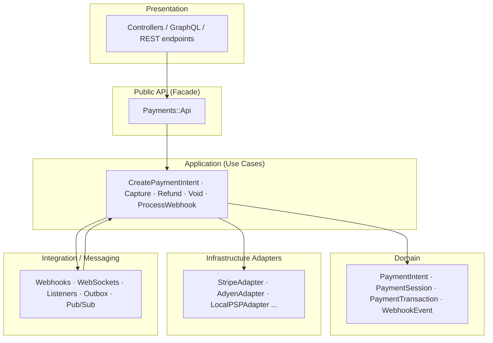

## Introducción: por qué casi todos los sistemas de pagos terminan siendo un infierno

Llevo varios años trabajando con sistemas de pagos. He integrado más de 15 pasarelas distintas — Stripe, PayPal, Adyen, CardConnect, Xendit, Razorpay, BAC, OnePay, PixelPay y un largo etcétera. Y si algo aprendí es esto:

> *Casi nadie diseña la arquitectura de un sistema de pagos antes de necesitarla. Se va añadiendo un gateway, luego otro, luego otro, hasta que el código se vuelve inmantenible.*

El patrón que veo repetirse en empresa tras empresa es siempre el mismo: el primer gateway se integra "rápido y sucio" porque hay que salir a producción. El segundo se copia del primero. El tercero ya empieza a tener sus condicionales especiales. Y para el quinto, agregar un gateway nuevo es un proyecto de **3 meses** que toca 15 archivos distintos.

Yo mismo viví eso. Y tras varias rondas de refactor — algunos exitosos, otros que tuve que rehacer — fui consolidando un blueprint mental de cómo debería diseñarse un sistema de pagos multi-gateway desde el día uno. Este post es ese blueprint.

No es una receta universal. Es **lo que yo haría si arrancara hoy un sistema de pagos** que tiene que soportar múltiples pasarelas, múltiples países, múltiples métodos de pago, y crecer sin colapsar. Si llegaste tarde y ya tienes un sistema hecho un desastre, también te sirve: las últimas secciones cubren la estrategia de migración.

Está dirigido a arquitectos, tech leads y devs senior que tienen que tomar decisiones de diseño. No voy a entrar en detalles específicos de Stripe vs Adyen — voy a hablar de **conceptos generalizables** que aplican sin importar el stack, el lenguaje o la región.

Vamos.

---

# Parte I — Fundamentos

## 1. ¿Por qué multi-gateway no es opcional?

Cuando alguien me dice *"para qué tantos gateways, con uno basta"*, mi respuesta siempre incluye estos cinco puntos:

* 🌍 **Cobertura geográfica.** No existe un único PSP que cubra el mundo entero con buen pricing. Stripe es excelente en US/EU pero en Latinoamérica deja huecos. En India, RBI exige procesadores locales. En Brasil, Pix cambió las reglas del juego.

* 💸 **Tarifas competitivas.** Tener dos PSPs en paralelo te da **poder de negociación**. Le dices a Stripe "Adyen me cobra X" y de repente bajan su fee. Si solo tienes uno, estás a merced de su pricing.

* 🛡️ **Resiliencia.** Los PSPs se caen. Stripe ha tenido incidentes globales de varias horas. Si el 100% de tu revenue pasa por un solo gateway, una caída del PSP **es una caída tuya**. Con failover bien diseñado, los usuarios ni se enteran.

* 🏦 **Métodos de pago locales.** Pix en Brasil, OXXO en México, iDEAL en Holanda, UPI en India, SEPA en Europa. Cada región tiene su método preferido — y los locales suelen tener mejor conversión y menores fees que las tarjetas.

* ⚖️ **Regulación.** PSD2 + SCA en Europa, RBI en India, Open Finance en Brasil. Cada año aparecen nuevas exigencias. Estar atado a un solo PSP te deja a su ritmo de implementación.

He visto a empresas perder el equivalente a **cientos de miles de dólares** en una sola tarde por depender de un único gateway que se cayó. La pregunta no es *si* va a pasar; es *cuándo*.

---

## 2. Los 7 anti-patrones que matan a un sistema multi-gateway

Antes de hablar de cómo hacerlo bien, déjame mostrarte qué he visto repetirse en cada sistema que tuve que rescatar. Si alguno de estos te suena familiar, ya sabes por dónde empezar:

1. **God-model `Payment`.** Un único modelo de 1500+ líneas que mezcla ledger, callbacks, cobros, refunds, cuentas por cobrar, créditos, eventos y notificaciones realtime. Cualquier cambio toca a 30 personas.

2. **HTTP dentro de transacciones de base de datos.** Un `before_create` o un `transaction do ... gateway.charge ... end` mantiene locks de DB abiertos durante la llamada al PSP. Cuando Rails (o tu framework) reintenta y el PSP ya cobró → **doble cobro real**.

3. **Dispatch dinámico sin contrato.** `"#{gateway.classify}::Charge".constantize.call`. Sin capability check, sin tipado, sin observabilidad por gateway. Funciona en demo, se cae en producción.

4. **Webhooks sin disciplina.** Sin verificación de firma, sin dedupe, sin persistencia del payload crudo. He visto pagos perdidos solo porque un crash mató al worker antes de procesar el webhook.

5. **Frontend acoplado al gateway.** Un `switch (gateway)` de 13 ramas en el cliente. Agregar un gateway = tocar el front, el back, el mobile, y rezar.

6. **Procesamiento síncrono donde no debería serlo.** Bloquear al usuario 30 segundos esperando que un PSP latinoamericano responda. Spoiler: timeouts, retries del usuario, doble cobro.

7. **Una sola fuente de verdad.** Confiar 100% en el webhook. O solo en el response síncrono. O solo en el cron de reconciliation. Spoiler: las tres mienten en algún momento. **Necesitas cruzarlas**.

> *Si tu sistema actual tiene 3 o más de estos, no estás solo. Lo que sigue es cómo no caer en ellos.*

---

## 3. Arquitectura por capas — el blueprint base

La base de todo es separar responsabilidades en capas claras, donde **cada capa solo conoce la inmediatamente inferior**. Esto es lo que llamo el blueprint base — funciona en cualquier lenguaje, en cualquier framework.



Las **6 capas que separo siempre**:

| Capa | Responsabilidad | Lo que NO hace |
|---|---|---|
| **Presentation** | Cargar recursos, autorizar, delegar al facade, renderizar | Lógica de pricing, selección de gateway, llamadas HTTP al PSP |
| **Public API (Facade)** | Único entry point al dominio de pagos. Retorna resultados tipados | Permitir que código externo toque internals |
| **Application (Use Cases)** | Orquestar el flujo: idempotency → gateway selection → adapter call → persistir | Hablar HTTP directamente; saltarse el dominio |
| **Domain** | Entidades, state machines, invariantes financieras | Conocer HTTP, SDKs o adapters concretos |
| **Infrastructure Adapters** | Un adapter por gateway. Habla HTTP/SDK. Normaliza errores | Tocar el ledger; conocer el dominio de negocio |
| **Integration / Messaging** | Webhooks entrantes, sockets, eventos de dominio, outbox | Lógica de negocio; persistencia financiera |

La regla de oro es: **el dominio no sabe que existe Stripe. El controller no sabe que existe Adyen.** Toda la complejidad gateway-específica vive en los adapters.

---

# Parte II — Las abstracciones core

## 4. Las abstracciones del dominio que no pueden faltar

Estas son las 9 abstracciones que aparecen en todo sistema de pagos serio que he construido o auditado. Si alguna falta, hay un dolor garantizado más adelante:

* **`PaymentIntent`** — la intención de negocio. Es lo que el usuario quiere lograr: cobrar X monto por Y producto. Tiene una **state machine** explícita (`created → authorized → captured → refunded`) e invariantes financieras. Es la unidad de trabajo del dominio.

* **`PaymentTransaction`** — el log técnico **append-only**, una fila por cada llamada al PSP (authorize, capture, refund, void, tokenize). Es donde reconciliation va a buscar la verdad cuando el PSP y tu ledger no coinciden.

* **`PaymentSession`** — la sesión PSP-hosted. Cuando usas Drop-in, hosted fields, 3DS challenge o redirect, el PSP te devuelve un `session.id` con TTL. Eso no pertenece al `PaymentIntent` — vive aparte.

* **`PaymentMethod` / `Token`** — el método de pago tokenizado. Nunca guardes PAN/CVV. Guarda el token del PSP + metadata (last4, brand, exp).

* **`WebhookEvent`** — el evento crudo del PSP, persistido **antes** de procesar. Incluye payload, headers, IP, firma verificada y un `UNIQUE(gateway, event_id)` que garantiza dedupe a nivel DB.

* **`IdempotencyRecord`** — el recovery point. No alcanza con un `Idempotency-Key`; necesitas saber **en qué paso del flujo estás** para no repetir el cobro.

* **`GatewayRegistry` + `CapabilityRegistry`** — el catálogo de gateways y qué puede hacer cada uno. El dominio consulta capacidades *antes* de actuar.

* **`OperationResult`** — éxito o fracaso **tipado**. `CardDeclined`, `RequiresAction`, `InsufficientFunds` son **resultados**, no excepciones. Las excepciones quedan para bugs reales.

* **`OutboxEntry`** — el patrón outbox. Garantiza que un evento de dominio se publique exactamente cuando la transacción de DB se commitea, no antes, no después.

> *La diferencia entre un sistema que escala y uno que no es si estas 9 piezas existen como conceptos explícitos o están **dispersas como columnas y banderas en un único modelo gigante**.*

---

## 5. Los 8 flujos canónicos (+ reconcile)

Toda operación que cualquier PSP del mundo te puede ofrecer se reduce a estos **8 flujos**. Si tu sistema tiene 30 "operaciones distintas", lo más probable es que tengas 8 mal mapeadas.

| Flujo | Qué hace |
|---|---|
| `tokenize` | Convertir un método de pago en un token reutilizable |
| `authorize` | Reservar fondos sin cobrar |
| `capture` | Cobrar fondos previamente autorizados |
| `sale` | Authorize + Capture en un solo paso |
| `refund_full` | Devolver el monto completo |
| `refund_partial` | Devolver parte del monto |
| `void` | Cancelar una autorización no capturada |
| `webhook_event` | Procesar un evento asíncrono del PSP |

Más uno extra que rara vez se modela bien:

| Flujo | Qué hace |
|---|---|
| `reconcile` | Cruzar el estado del PSP contra mi ledger |

Cada gateway implementa **solo el subset que su capability registry declara**. Por ejemplo: BAC no soporta `void`, Razorpay no soporta `capture` separado de `sale`. Tu dominio lo sabe vía el `CapabilityRegistry` y no intenta llamar a operaciones inexistentes.

> *Si tu equipo está debatiendo "¿esto es un capture o un sale?", es señal de que el modelo está bien — porque la pregunta tiene una sola respuesta correcta. Si están debatiendo "¿esto es un `processPayment_v2_for_BAC` o un `processPayment_alternate`?", es señal de que el modelo no existe.*

---

## 6. Capability Registry — el cerebro detrás del multi-gateway

Esta es la pieza que más subestiman los equipos. El `CapabilityRegistry` es donde declaro **qué puede hacer cada gateway**:

```yaml
stripe:
  hosted_fields: true
  3ds: true
  auth_capture: true
  one_step_sale: true
  refund_partial: true
  void: true
  card_on_file: true
  recurring: true
  webhook: true

adyen:
  hosted_fields: true
  3ds: true
  auth_capture: true
  refund_partial: true
  void: true
  card_on_file: true
  webhook: true

bac:
  direct_pan: true
  one_step_sale: true
  refund_full: true
  refund_partial: false
  void: false
  webhook: false
```

¿Por qué importa tanto?

Porque el dominio puede preguntar antes de actuar:

```ruby
if registry.supports?(gateway, :void)
  adapter_for(gateway).void(intent)
else
  adapter_for(gateway).refund_full(intent)
end
```

Sin esto, terminas con `if gateway == 'bac'` regados por todo el código. Con esto, **agregar un gateway nuevo es declarar sus capacidades y escribir su adapter — no tocar 15 archivos**.

Es también lo que el frontend consulta vía API: *"para este facility, con este método de pago, ¿qué puedo ofrecer al usuario?"*. La UI se vuelve dinámica sin acoplarse a gateways específicos.

---

# Parte III — Patrones de diseño que uso siempre

## 7. Patrones de diseño aplicados a payments

Voy a ser concreto: estos son los **patrones que efectivamente uso** en sistemas de pagos, no una lista académica de GoF. Cada uno resuelve un problema específico.

### 7.1 Adapter
Un contrato uniforme (`GatewayAdapter`), N implementaciones (`StripeAdapter`, `AdyenAdapter`…). Cada adapter expone los flujos canónicos que su gateway soporta. La inspiración clara es **ActiveMerchant** del mundo Ruby.

### 7.2 Strategy
Selección dinámica del gateway según contexto: país, moneda, método de pago, monto, hora del día. El Strategy vive en una capa por encima de los adapters y decide *cuál* usar.

### 7.3 Registry
Lookup por nombre + metadata. El `GatewayRegistry` resuelve `"stripe"` → `StripeAdapter`. El `CapabilityRegistry` resuelve `("stripe", :3ds)` → `true`.

### 7.4 Factory
Construye adapters con sus dependencias inyectadas (credenciales del facility, logger, HTTP client). Centraliza la creación.

### 7.5 Chain of Responsibility
Un pipeline de validaciones antes de llamar al PSP: ¿tenemos credenciales? ¿el monto es válido? ¿el método de pago tiene los permisos? ¿hay anti-fraude que aprobar? Cada handler decide si continúa o aborta.

### 7.6 Saga / Process Manager
Para flujos largos: authorize → esperar 3DS → confirm → capture. **No uso transacciones distribuidas** entre mi DB y el PSP — es imposible. Modelo cada paso como una etapa de saga con su propio commit local + idempotency.

### 7.7 Outbox Pattern
El más subestimado de todos. Cuando creo un `PaymentIntent`, escribo en la misma transacción de DB:
1. El `PaymentIntent` con estado `authorized`.
2. Una fila en `outbox_entries` con el evento `PaymentAuthorized`.

Un worker independiente lee la outbox y publica al bus (Kafka, RabbitMQ, Pub/Sub). **Garantía exactly-once a costa de potencialmente entregar duplicados — pero nunca de perder eventos**.

### 7.8 Circuit Breaker
Cuando un PSP está caído, no quiero seguir mandándole requests. El circuit breaker abre el circuito tras N fallos consecutivos, deja pasar requests de prueba después de un cooldown, y se recupera solo. Sin esto, una caída del PSP **te tumba a ti**.

### 7.9 Bulkhead
Separo los workers / threads / colas por gateway. Si Xendit está lento y satura su pool, **Stripe sigue funcionando**. Sin bulkheading, un PSP lento contamina a todos los demás.

---

## 8. Idempotencia — la disciplina que evita el doble cobro

Si tuviera que elegir **un único concepto** que define la madurez de un sistema de pagos, sería este. Y casi nadie lo hace bien.

Lo que la mayoría hace: mandar un `Idempotency-Key` al PSP. Está bien, pero **no es suficiente**.

Lo que hace Brandur en su famoso post sobre Rocket Rides (te lo recomiendo si no lo has leído): cada operación de pago es una secuencia de pasos, y cada paso es un **recovery point**. Si crasheo en el paso 3, al reintentar arranco desde el paso 3 — no desde cero.

Pseudo-flujo:

```
1. CreatePaymentIntent → recovery_point = 'intent_created'
2. CallGatewayAuthorize → recovery_point = 'authorized'
3. PersistTransactionLog → recovery_point = 'logged'
4. PublishEvent → recovery_point = 'published'
5. Done → recovery_point = 'done'
```

Si crasheo entre 2 y 3, el reintento ve `authorized` y **no vuelve a llamar al PSP**. Solo persiste el log y publica el evento.

**La regla de oro:** nunca llamar al PSP dentro de una transacción de DB. La secuencia es:

1. Persistir el intento + idempotency key (commit).
2. Llamar al PSP (sin transacción abierta).
3. Persistir el resultado + actualizar recovery point (commit).

El escenario más peligroso es el **timeout del PSP**. Si el PSP no responde, **no sabes si cobró o no**. La única salida segura: dedicar el siguiente reintento a **consultar el estado** (no a reintentar el cobro). Aquí es donde el `Idempotency-Key` te salva — al consultar, el PSP devuelve el resultado de la primera llamada.

Idempotency vive a **tres niveles**: en el cliente (no doble click), en tu API (no doble request del cliente), y en el adapter (no doble llamada al PSP).

---

# Parte IV — Comunicación con el mundo exterior

## 9. Webhooks — la pieza más subestimada

Los webhooks son donde más he visto perder pagos. Tres reglas innegociables:

### 9.1 Persistir el payload crudo ANTES de procesar
La secuencia que uso:
1. Recibo el HTTP request del PSP.
2. Verifico firma (timing-safe — `==` no sirve, leak de side-channel).
3. Persisto `WebhookEvent` con raw payload, headers, IP, `signature_verified`, y un `UNIQUE(gateway, event_id)`.
4. Encolo job de procesamiento.
5. Respondo `200 OK` al PSP.
6. El worker procesa el evento desde la tabla, **no desde el request HTTP**.

¿Por qué? Si el worker crashea, el evento sigue en la DB. Si el PSP reenvía, el `UNIQUE` lo deduplica. Si necesito debuggear, el raw payload está ahí.

### 9.2 Responder 200 OK antes de procesar
Muchos PSPs reintentan agresivamente si tardas más de 5 segundos. **No proceses el evento de forma síncrona**. Persiste, encola, responde 200, y procesa async. Si después falla, lo retomas — ya tienes el raw.

### 9.3 Orden de eventos
Los webhooks **no llegan en orden**. Puedes recibir `payment.refunded` antes que `payment.captured` por race conditions del PSP. Tu state machine debe ser tolerante: si llega `refunded` y el intent está en `authorized`, lo dejas en una cola de "pendiente de reordenar" y reintenta cuando llegue `captured`.

> *Y por favor: nunca confíes en que el webhook es la única señal. Es **una** señal. La verdad la define reconciliation.*

---

## 10. Sockets y comunicación en tiempo real

Aquí entran flujos que muchos olvidan diseñar. Cuando un pago es **asíncrono** (Xendit, 3DS con redirect, Pix con QR), el usuario está mirando una pantalla esperando el resultado. ¿Cómo le aviso cuándo termina?

### 10.1 WebSockets
Conexión bidireccional persistente. Útil cuando necesitas push del backend al cliente. El patrón típico:

1. El cliente abre socket y se subscribe a `payment_intent.{id}`.
2. Backend recibe webhook → procesa → publica evento interno.
3. Un listener escucha el evento y emite por el socket al cliente subscrito.
4. El cliente recibe el evento y actualiza la UI.

### 10.2 Server-Sent Events (SSE)
Más simple que WebSocket si solo necesitas comunicación **del backend al cliente**. HTTP plano, reconnect automático, fácil de operar. Lo uso cuando el flujo es solo "esperar resultado de pago" y no requiere bidirección.

### 10.3 Long polling
Cuando WebSocket no es viable (corporate proxies, ambientes legacy). El cliente hace request, el backend lo retiene hasta tener resultado o timeout, y responde. El cliente repite. Sirve, pero escala peor.

### 10.4 Push via PubSub provider (Pusher, Ably, Pub/Sub)
Para mobile + multi-cliente. El cliente se subscribe a un canal y el backend publica al canal. Manejas menos infraestructura propia.

### Tabla comparativa rápida

| Mecanismo | Bidireccional | Operativamente | Cuándo lo uso |
|---|---|---|---|
| WebSocket | Sí | Complejo (sticky sessions, scale-out) | Apps con muchas interacciones realtime |
| SSE | No (solo server→client) | Simple | Notificación de resultado de pago |
| Long polling | No | Sencillo, mal performance | Ambientes con restricciones de red |
| PubSub provider | Sí | Tercerizado | Mobile + multi-device |

---

## 11. Listeners y arquitectura event-driven

Cuando un pago se autoriza, suelen pasar **muchas cosas**: enviar email, actualizar inventario, notificar al CRM, gatillar workflows de loyalty, escribir al data warehouse. Si lo haces todo síncrono en el use case, el código se vuelve un monstruo.

La solución es publicar **eventos de dominio** y dejar que listeners reaccionen.

### 11.1 Domain events vs Integration events
Esta diferencia casi nadie la respeta y es crítica:

* **Domain events** — internos a tu sistema. Ejemplo: `PaymentAuthorized`. Los publicas en proceso o en un bus interno. Los consume tu propio código.
* **Integration events** — para sistemas externos. Ejemplo: `customer.charge.completed`. Los publicas a Kafka/Pub/Sub. Los consume otro servicio o equipo.

Mezclarlos es un error: cambias un domain event interno y rompes un consumidor externo del que no sabías.

### 11.2 Listeners idempotentes
Los eventos se **reentregan**. Tu listener debe ser idempotente. Si recibe el mismo evento dos veces, no manda dos emails, no carga dos veces el saldo. Esto se logra con un `processed_events` table o con un check explícito antes de actuar.

### 11.3 Event sourcing parcial
No hago event sourcing completo en payments (es overkill y complica la consistencia financiera), pero sí uso `PaymentTransaction` **como log de eventos**: una fila append-only por cada acción significativa. El estado del `PaymentIntent` se deriva del último estado válido, pero la historia está intacta.

### 11.4 Cómo evito que se vuelva un caos
- **Registro explícito** de listeners. Nada de auto-discovery mágico.
- **Naming convention**: `On<Event>` (e.g. `OnPaymentAuthorized::SendReceiptEmail`).
- **Un listener por archivo**, un test por listener.
- **Lista única** de eventos del dominio, documentada como contrato.

---

## 12. Polling — cuando no queda otra

Algunos PSPs (especialmente en mercados emergentes) **no envían webhooks confiables** o los envían con horas de retraso. Para estos casos, polling es la salida pragmática.

Estrategia:
1. Crear el intent.
2. Encolar un job que consulta el estado del PSP.
3. Si no hay resolución, reencolar con **backoff exponencial** (1s, 5s, 30s, 2min, 10min…).
4. Cortar a un timeout sensato (24h o lo que dicte el PSP).
5. Si pasa el timeout sin resolución, el intent va a `expired` y reconciliation lo detecta.

Polling **no reemplaza** webhooks ni reconciliation. Es una tercera señal. Las tres se complementan.

---

# Parte V — Estrategias operativas y de resiliencia

## 13. Retry, failover y backoff

Aquí distingo cuatro estrategias que **no son intercambiables**:

| Estrategia | Cuándo aplica | Riesgo |
|---|---|---|
| **Retry inmediato** | Timeout puro, network blip | Muy bajo |
| **Retry con backoff** | 5xx del PSP, rate limit | Bajo |
| **Failover a otro gateway** | PSP completamente caído | **Alto** — riesgo de doble cobro |
| **No retry** | 4xx del usuario (CardDeclined, InsufficientFunds) | N/A — sería gastar fees |

**Backoff exponencial con jitter.** Sin jitter, todos tus workers reintentan al mismo tiempo y golpean al PSP justo cuando empieza a recuperarse. El jitter (variación aleatoria) los espacia.

**Failover entre gateways** es la estrategia más peligrosa. Si el PSP A ya cobró pero respondió con timeout, y haces failover a B, **acabas de cobrar dos veces**. Solo es seguro si:
- A definitivamente no cobró (respuesta explícita de error sin transacción persistida).
- O tienes un mecanismo posterior de reconciliation y refund automático.

**Dead Letter Queue (DLQ).** Todo lo que no se resuelve tras N reintentos va a la DLQ. Una persona revisa diariamente. Sin esto, los pagos fallidos se acumulan en silencio.

---

## 14. Selección dinámica de gateway (routing)

Routing es decidir, en tiempo real, **a qué PSP mando este pago**. Las estrategias que uso:

* **Routing por geografía/moneda** — pagos en BRL van a un PSP local; pagos en EUR van a Adyen.
* **Least-cost routing** — entre los PSPs habilitados, elijo el más barato para ese tipo de transacción.
* **Capability-based routing** — si necesito 3DS y el PSP A no lo soporta, voy al B.
* **A/B routing** — el 10% del tráfico va a un PSP nuevo para validarlo en producción.
* **Health-check routing** — si el circuit breaker de un PSP está abierto, lo excluyo automáticamente.

El routing debe ser **observable**: tengo que saber, para cada pago, *por qué* eligió el gateway que eligió. Un log estructurado con `routing_reason` me ha salvado de varios incidentes.

---

## 15. Reconciliation — la verdad cruzada

Reconciliation es la **red de seguridad** del sistema entero. Es lo que detecta cuándo tu ledger y el PSP no coinciden. Y casi siempre va a coincidir 99% — pero ese 1% es donde está el dinero perdido.

La idea es simple: descargar diariamente el extracto del PSP (settlements, payouts) y compararlo contra tu `PaymentTransaction` log. Tres outcomes posibles:

1. **Coinciden** → todo bien, marca como reconciliado.
2. **El PSP cobró pero no tienes registro** → ghost charge. Investiga.
3. **Tienes registro pero el PSP no cobró** → fantasma local. Posiblemente intent abandonado.

Mi recomendación cuando arrancas con un sistema legacy: **la primera capacidad de la nueva arquitectura que entregas a producción es reconciliation read-only**. ¿Por qué?

* Blast radius cero — no escribe nada.
* Valor inmediato a Finance Ops.
* Te enseña cómo es el modelo real de eventos del PSP sin riesgo.
* Te da una base de verdad para todo lo que viene después.

Schema gateway-agnostic + adapter por PSP. Agregar el segundo gateway a reconciliation es escribir un adapter, no migrar un schema.

---

## 16. Observabilidad — logs, métricas, traces, alertas

En payments, *"no sé qué pasó con ese pago"* no es una respuesta aceptable. La observabilidad mínima:

* **Logs estructurados con `correlation_id`** — todo lo que tocó ese pago (controller → use case → adapter → webhook → listener) comparte el mismo ID. Trazar un pago de punta a punta es un solo query.

* **Métricas críticas por gateway**:
  - Success rate (target > 95%).
  - Latencia P95/P99 (alerta si crece 50%).
  - Retry rate (si sube, algo está mal).
  - Webhook lag (tiempo entre evento del PSP y procesamiento).

* **Distributed tracing** (OpenTelemetry, Datadog APM) — sigue un pago desde el click del usuario hasta el settlement bancario.

* **Alertas con criterio.** Alarmar por *success rate < 90% sostenido 5 min* sí. Alarmar por *un pago falló* no. Aprende a calibrar; alertas mal calibradas matan equipos.

* **Dashboard por gateway + dashboard global.** Cuando algo se rompe, el primer instinto es *"¿es uno o son todos?"*.

---

# Parte VI — Seguridad y compliance

## 17. PCI, tokenización y vault

PCI-DSS es el marco regulatorio de tarjetas. Determina **qué tan auditado** tiene que estar tu sistema. La diferencia entre **SAQ A** (mínimo) y **SAQ D** (máximo) son cientos de miles de dólares al año en compliance.

La regla que sigo: **nunca toco PAN/CVV en mi infraestructura**. Uso:

* **Hosted fields / iframes del PSP** — el usuario teclea la tarjeta dentro de un iframe del PSP. Tú nunca ves los datos.
* **Drop-in UI** — el PSP te da un componente UI completo. Aún más simple.
* **Tokenización en el cliente** — SDK del PSP convierte la tarjeta en un token *antes* de tocar tu servidor.

¿Vault propio? **Casi nunca vale la pena**. El costo de mantener PCI SAQ D supera por mucho el ahorro en fees. Excepción: si tu negocio es procesar pagos a escala masiva y los fees del vault del PSP son prohibitivos.

**Network tokens** son el futuro cercano. En vez de tokens propietarios del PSP, las redes (Visa, Mastercard) emiten tokens que sobreviven a re-emisiones de tarjeta. Tu rate de aprobación sube.

**3DS / SCA** — necesario en Europa por PSD2, opcional en otras regiones. Mi recomendación: integralo desde el inicio aunque tu mercado no lo exija — luego no quieres retrofittearlo.

---

## 18. Seguridad operativa

Más allá de PCI, hay capas de seguridad operativa que muchos olvidan:

* **Rate limiting** — por IP, por user, por método de pago. Sin esto, eres víctima fácil de **card-testing attacks** (bots probando tarjetas robadas en tu sistema).

* **Card-testing detection** — patrones como muchos rechazos seguidos desde la misma IP, montos chiquitos consecutivos, tarjetas con BIN sospechoso. Modelo simple → alerta → bloqueo temporal.

* **Honeypots** — endpoints decoy, campos anti-bot en formularios, partial fake credentials. Detectan probing sin alertar al atacante. Es seguridad **observability low-interaction** — no bloqueas, observas.

* **Rotación de credenciales del PSP** — calendarizada, automatizada, sin downtime. Si un secret leakea, debe ser cambiable en minutos.

* **Auditoría de accesos** — quién consulta qué método de pago de qué usuario. Log inmutable.

---

# Parte VII — Frontend en sistemas multi-gateway

## 19. Cómo no acoplar tu UI al gateway

El frontend es donde más he visto sistemas multi-gateway colapsar. El típico patrón malo: `if (gateway === 'stripe') { ... } else if (gateway === 'adyen') { ... }` por todas partes.

Lo que hago en su lugar:

### 19.1 Plugin pattern
La UI emite **eventos canónicos**, no eventos por gateway. Los eventos son del estilo `payment:requires_action`, `payment:authorized`, `payment:failed`. El plugin (que internamente sí conoce al gateway) traduce los eventos del SDK del PSP a este vocabulario común.

El resto del frontend escucha **solo** los eventos canónicos. Agregar un gateway nuevo = escribir un plugin nuevo. No tocar el resto.

### 19.2 Hosted fields / iframes del PSP
Reducen el PCI scope a casi nada. Trade-off: pierdes algo de control de UX. En 9 de cada 10 casos vale la pena.

### 19.3 Capability-driven UI
El frontend consulta a la API: *"para este facility + método + monto, ¿qué puedo ofrecer?"*. El backend responde con las capacidades aplicables. La UI se renderiza dinámicamente.

Resultado: si mañana un facility cambia de gateway, la UI se adapta sola — sin redeploy del frontend.

### 19.4 Mobile
- Deep links para volver a la app tras un 3DS web.
- SDK nativo del PSP cuando exista (mejor UX).
- Fallback a web view cuando no.
- Mismo vocabulario canónico de eventos que el web.

---

# Parte VIII — Testing, despliegue y migración

## 20. Testing en sistemas de pagos

No puedes confiar en tests manuales. Lo que uso:

* **Contract testing** — el adapter cumple el contrato del `GatewayAdapter`. Sin esto, alguien rompe la interfaz y nadie se da cuenta hasta producción.

* **Fake gateways** (`BogusGateway` à la ActiveMerchant) — adapter en memoria con escenarios programables: `decline`, `requires_action`, `timeout`, `network_error`. Permite testear flujos completos sin tocar al PSP real.

* **Sandbox del PSP** — para tests de integración nightly. Lentos pero realistas.

* **Webhook replay tests** — alimento el sistema con secuencias grabadas de webhooks reales (en orden y desorden) y verifico que el state machine se comporta bien.

* **Chaos / load tests** — antes de meter un PSP nuevo a producción: ¿qué pasa con 1000 webhooks/segundo? ¿qué pasa si el PSP devuelve timeouts el 20% del tiempo?

---

## 21. Estrategias de despliegue

* **Feature flags por gateway + por facility** — habilito el gateway nuevo para 1 cliente, luego para 10, luego para 100. Si algo falla, revierto el flag.

* **Canary deployments** — un % chico del tráfico va a la versión nueva. Observo métricas. Promuevo si todo está bien.

* **Shadow mode** — el gateway nuevo procesa **en paralelo** al actual pero **no commitea**. Comparo los resultados. Valido sin riesgo financiero.

* **Strangler-fig** — para sistemas legacy. Lo cubro en la siguiente sección.

---

## 22. Migración: cuando ya tienes un sistema legacy hecho un desastre

Si llegaste a este post con un sistema legacy que ya tiene 5 anti-patrones encima, no te desesperes. Yo he migrado varios. La estrategia que funciona:

### 22.1 No hagas un rewrite
Los rewrites de sistemas de pagos **fracasan el 90% del tiempo**. Demasiada lógica de negocio invisible, demasiados edge cases que solo viven en producción. No vas a poder pararlos durante 6 meses para reescribir.

### 22.2 Strangler-fig + nuevo gateway como piloto
La estrategia que me ha funcionado: introducir la nueva arquitectura **junto con un gateway nuevo** (greenfield). El gateway nuevo vive 100% en el nuevo modelo. El legacy queda intacto.

¿Por qué con uno nuevo? Porque no carga deuda histórica, no rompe paridad con clientes existentes, y te deja validar el diseño sin riesgo de regresión.

### 22.3 Reconciliation-first
La primera capacidad de la nueva arquitectura que entregas a producción es **reconciliation read-only sobre el legacy**. Cero blast radius, valor inmediato, te enseña el modelo real.

### 22.4 Coexistencia larga
El legacy y la nueva arquitectura van a convivir **meses o años**. Acéptalo desde el principio. Diseña los namespaces y las abstracciones pensando en convivencia, no en switch.

### 22.5 Retira el legacy cuando ya no quede nada
El último gateway legacy se migra cuando hay justificación de negocio (cambio de pricing, nueva capability requerida). No por estética arquitectónica.

---

# Parte IX — Lo que NO debes hacer

## 23. Errores que cometí o vi cometer

Cierro con la lista anti-pattern definitiva. Si no haces nada de lo anterior pero al menos evitas esto, ya estás mejor que la mayoría:

* ❌ **Dual-write entre dos ledgers.** Mantener dos `Payment`-equivalentes sincronizados durante meses introduce más bugs financieros de los que arregla.

* ❌ **Migrar todos los gateways al mismo tiempo.** Strangler-fig siempre. Uno por uno.

* ❌ **Esconder los gateways detrás de una gem/lib "mágica"** que abstrae todo. Pierdes control de los flows reales, depuras a ciegas, y la magia se rompe cuando un PSP introduce un edge case nuevo.

* ❌ **Tratar a los webhooks como source of truth.** Son notificaciones. La verdad la define reconciliation cruzando contra el ledger del PSP.

* ❌ **Hacer failover automático entre gateways sin idempotency garantizada.** Riesgo de doble cobro real.

* ❌ **Mantener tarjetas en tu propia DB.** El costo de PCI SAQ D es brutal. Casi nunca compensa.

* ❌ **Acoplar tu modelo financiero al modelo del PSP.** Tu `PaymentIntent` no debería tener un campo `stripe_payment_intent_id`. Debería tener un `gateway` + `external_id` agnóstico.

* ❌ **No persistir el raw payload de los webhooks.** Cuando algo falle en producción (y va a fallar), sin el raw payload estás a ciegas.

* ❌ **Reintentar todo, incluidos los 4xx.** `CardDeclined` no se reintenta. `InsufficientFunds` no se reintenta. Cada reintento es un fee gastado.

* ❌ **No tener observabilidad por gateway.** Cuando tu success rate global cae al 80%, necesitas saber **cuál PSP** es el culpable en segundos, no en horas.

---

## Conclusión: la arquitectura no se hace en PowerPoint, se construye iterando

Lo que leíste no es teoría. Es la suma de cicatrices de varios proyectos donde aprendí lo que NO funciona — a veces a costa de incidentes en producción, otras veces refactorizando código heredado que ya nadie entendía.

Si arrancas hoy un sistema de pagos multi-gateway, este esqueleto te va a evitar dolor en dos años:

1. **Separa las 6 capas** desde el día uno.
2. **Modela las 9 abstracciones core** explícitamente — no como columnas en un modelo gigante.
3. **Usa los 8 flujos canónicos** + reconcile como vocabulario único.
4. **Capability registry** como cerebro del multi-gateway.
5. **Adapters con contrato uniforme**, errores normalizados en el borde.
6. **Idempotencia con recovery points**, no solo con `Idempotency-Key`.
7. **Webhooks → persistir antes de procesar**, dedupe en DB.
8. **Sockets / SSE** para feedback realtime al usuario.
9. **Listeners idempotentes** para mantener el código de los use cases limpio.
10. **Reconciliation read-only** como red de seguridad.
11. **Observabilidad y métricas por gateway**.
12. **PCI scope mínimo** — hosted fields, jamás vault propio salvo excepción.

Si llegaste tarde y ya tienes un sistema legacy, el camino es: **strangler-fig + nuevo gateway como piloto + reconciliation-first**. No rewrite. No big-bang. Coexistencia larga, migración incremental.

Ningún sistema de pagos sobrevive sin disciplina arquitectónica. Y la disciplina arquitectónica se construye **antes** de necesitarla, no después.

> *El día que un PSP global se cae durante 4 horas, y tu sistema sigue funcionando porque routeó al backup automático, es el día que entiendes por qué valió la pena cada hora invertida en este esqueleto.*

---

## Referencias y fuentes primarias

Lo que cuento aquí lo aprendí en producción, pero los principios se apoyan en specs y literatura que vale la pena tener a mano:

- [Stripe API Reference — Idempotent Requests](https://docs.stripe.com/api/idempotent_requests) — la implementación de referencia de idempotency keys en un PSP moderno.
- [Adyen Documentation — Payment methods](https://docs.adyen.com/payment-methods/) — buen ejemplo de cómo se modela el matrix de capabilities por país y método.
- [EMVCo 3-D Secure Specification](https://www.emvco.com/emv-technologies/3d-secure/) — la spec original de 3DS 2.x. Si vas a integrar 3DS, léela.
- [PCI DSS v4.0](https://www.pcisecuritystandards.org/document_library/) — alcance, requirements, y por qué la capa de Gateway Adapters reduce dramáticamente tu PCI scope.
- [Brandur Leach — Implementing Stripe-like Idempotency Keys in Postgres](https://brandur.org/idempotency-keys) — el post canónico sobre idempotency a nivel base de datos. Si trabajas con Postgres y pagos, es lectura obligada.
- [Martin Fowler — StranglerFigApplication](https://martinfowler.com/bliki/StranglerFigApplication.html) — la estrategia de migración que menciono en el cierre.
- [Adyen Engineering — Building reliable payment systems](https://www.adyen.com/blog/building-reliable-payment-systems) — buena referencia sobre reconciliation y observability en producción.

Si quieres profundizar en algún punto específico de este post, [escríbeme](mailto:adan.condoric@gmail.com). Y si tienes un sistema de pagos legacy y no sabes por dónde empezar la migración, también — me interesa mucho ver cómo lo han estructurado otros equipos.

---

*En el próximo post de esta serie hablaremos de cómo comunicar arquitectura de payments a stakeholders no técnicos — el arte de pasar de diagramas a decisiones de negocio.*
